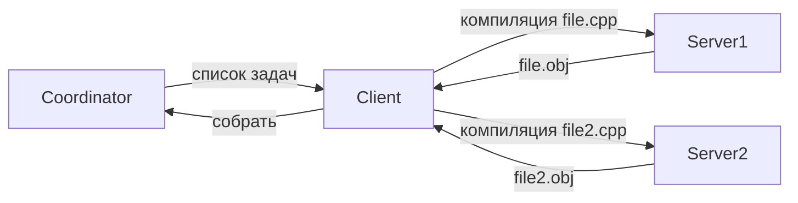

# RdBuild

**Распределённая система сборки C++ проектов**  
(аналог Incredibuild, реализованный на C#)

[](https://dotnet.microsoft.com/)
[](LICENSE)

---

## Идея проекта

`RdBuild` позволяет распараллелить компиляцию C++ кода на несколько машин в локальной сети.  
Координатор раздаёт задачи (отдельные `.cpp` файлы) агентам-серверам, которые выполняют компиляцию и возвращают объектные файлы.

**Проблема:** сборка большого C++ проекта на одной машине может занимать часы.  
**Решение:** распределение по агентам сокращает время в N раз (по числу ядер/машин).

---

## Архитектура



### Компоненты

- **Coordinator** – управляет очередями задач (C++ файлов).
- **Client** – отправляет задачи агентам, собирает результаты.
- **Server** (Agent) – запускает `cl.exe` / `g++` и возвращает результат.

**Коммуникация:** TCP + бинарный протокол (своя реализация, без внешних RPC-библиотек).

---

## Текущий стек

- **Язык:** C# (.NET 8)
- **Платформа:** Windows (агенты могут работать на Linux, если компилятор установлен)
- **Библиотеки:** только стандартные (`System.Net.Sockets`, `System.Diagnostics`) + Newtonsoft.Json
- **Сборка:** `dotnet build` или Visual Studio 2022

---

## Состояние проекта

⚠️ **Статус:** прототип / proof-of-concept (не промышленное решение)

✅ **Что работает:**
- базовая диспетчеризация задач
- удалённый запуск компиляции
- возврат объектных файлов
- регистрация серверов в координаторе

❌ **Что не реализовано:**
- автоматическое обнаружение агентов
- отказоустойчивость
- GUI / консольный клиент
- поддержка Linux-агентов «из коробки»

Проект не развивался с 2022 года, но код компилируется и базово работает под .NET 8.

---

## Быстрый старт (за 3 шага)

### 1. Клонировать репозиторий
```bash
git clone https://github.com/mberezovsky/RdBuild.git
cd RdBuild
```

### 2. Собрать
```bash
dotnet build -c Release
```
(или открыть `RdBuild.sln` в Visual Studio 2022 и нажать Build)

### 3. Запустить (пример)
```bash
# Терминал 1: координатор
dotnet run --project RdBuild.Coordinator

# Терминал 2: сервер (агент)
dotnet run --project RdBuild.Server

# Терминал 3: клиент (указав файл для компиляции)
dotnet run --project RdBuild.Client -- --file test.cpp
```

> **Важно:** на машинах с агентами должен быть установлен компилятор C++ (`cl.exe` из MSVC или `g++`) и добавлен в `PATH`.

---

## Почему этот проект в портфолио?

Код демонстрирует:

- **Сетевое программирование** (TCP-сокеты, асинхронность)
- **Работу с процессами** (`Process.Start`, перенаправление ввода/вывода)
- **Архитектуру распределённой системы** (coordinator/worker)
- **Чистый C# без магии** (минимальное количество внешних зависимостей)

---

## Структура (ключевое)

```
RdBuild/
├── RdBuild.Coordinator/   # Центральный узел (раздаёт задачи)
├── RdBuild.Client/        # Отправляет задачи агентам
├── RdBuild.Server/        # Агент (выполняет компиляцию)
├── RdBuild.Shared/        # Общий код: протокол, команды
└── RdBuild.Shared.Tests/  # Unit-тесты (NUnit)
```

Полная структура — в самом репозитории.

---

## Лицензия

MIT — свободно используйте в любых целях.

---

## Автор

**Mikhail Berezovskiy**  
[GitHub](https://github.com/mberezovsky)

*Проект создан для демонстрации навыков при поиске работы.*